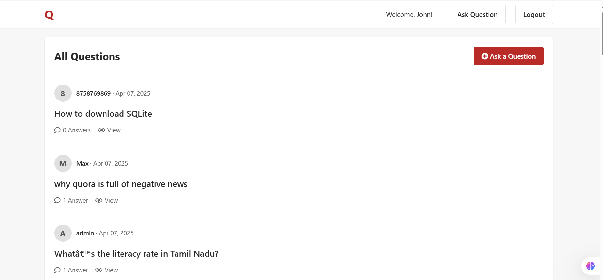
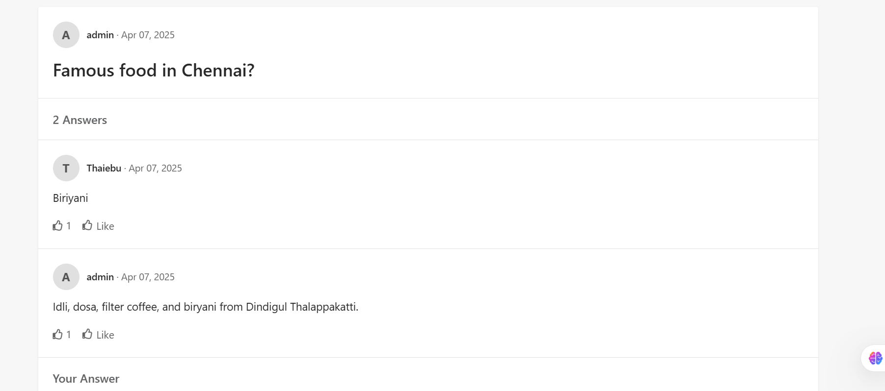

# 🧠 Quora Clone - Django Web App

A simple Quora-inspired question-and-answer web platform built using Django. This project allows users to register, log in, post questions, answer others' questions, and like answers.

---

## 🚀 Features

- ✅ User Registration and Login
- ✅ Post Questions
- ✅ View All Questions
- ✅ Post Answers to Questions
- ✅ Like Answers
- ✅ Logout Functionality

---


## 🛠 Tech Stack

- **Backend:** Django (Python)
- **Frontend:** HTML, CSS (with inline styles)
- **Database:** SQLite (default with Django)

---

## 🧩 Project Structure

---
```
quora_clone/
│
├── core/                # Main app for auth & base templates
│   ├── templates/core/  # Contains base.html, login.html, signup.html
│   ├── urls.py
│   ├── models.py        # Question, Answer, Like models
│   ├── views.py         # All core views
│   ├── forms.py         # Forms for question and answer input
│
│
├── manage.py
├── db.sqlite3
└── README.md
```
---

## ⚙️ Setup Instructions

1. **Clone the Repository**
```bash
git clone https://github.com/your-username/quora-clone.git
cd quora-clone
```

2. **Create Virtual Environment & Install Dependencies**
```bash
python -m venv venv
source venv/bin/activate  # On Windows: venv\Scripts\activate
pip install django
```

3. **Run Migrations**
```bash
python manage.py makemigrations
python manage.py migrate
```

4. **Start the Development Server**
```bash
python manage.py runserver
```

5. **Access the Site**
```
http://127.0.0.1:8000/
```
## 📸 Screenshots

>  screenshots.


---

## ✍️ How It Works

| Feature                 | Description |
|------------------------|-------------|
| **Register/Login**     | Users can sign up and securely log in |
| **Ask Questions**      | Authenticated users can post questions |
| **Answer Questions**   | Users can answer any question |
| **Like Answers**       | A like button to upvote good answers |
| **Logout**             | Ends the user session |

---

## 👤 Author

**Mohamed Thaiebu**  
[LinkedIn](https://www.linkedin.com/in/mohamed-thaiebu-0015a815a/) | [GitHub](https://github.com/thaiebu)

---

## 📝 License

This project is licensed under the MIT License.
```
